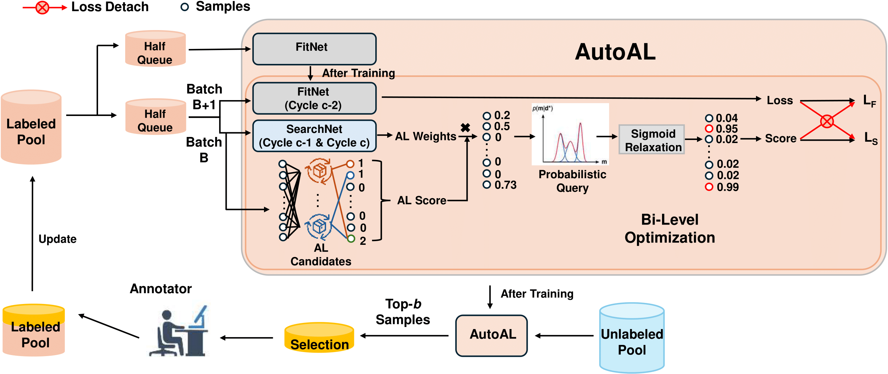

# [ICML 2025] AutoAL: Automated Active Learning with Differentiable Query Strategy Search

<h4 align="center">

**[AutoAL: Automated Active Learning with Differentiable Query Strategy Search](https://arxiv.org/abs/2410.13853)**

<p align="center">
  <a href="https://haizailache999.github.io/yifeng.github.io/">Yifeng Wang</a> 
  &nbsp;&nbsp;
  <a href="https://sinezhan.github.io/index.html">Xueying Zhan</a> 
  &nbsp;&nbsp;
  <a href="https://siyuhuang.github.io/">Siyu Huang</a> 
</p>

[](https://arxiv.org/abs/2410.13853)


</h4>
<p align="center">
  
</p>

**We propose the first automatic AL query strategy search method that can be trained in a differientiable way**. 

Feel free to contact me, [yifengw3@andrew.cmu.edu](https://haizailache999.github.io/yifeng.github.io/) or open an issue if you have any questions or suggestions.


## 📢 News
- **2025-05-20**: AutoAL is accepted to ICML 2025, the code has been released!


## 📋 TODO


## 🔧 Installation

```bash
git clone https://github.com/haizailache999/AutoAL.git
cd AutoAL
conda env create -f environment.yml -n AutoAL
conda activate AutoAL
```

## 🦾 AutoAL training and evaluation
### Dataset
Please refer to arguments.py, you need to config your own dataset_name, possible choices are shown in parameters.py.
For the dataset we used in our paper, please refer to [CIFAR 10 and CIFAR 100](https://www.cs.toronto.edu/~kriz/cifar.html), [SVHN](https://docs.pytorch.org/vision/main/generated/torchvision.datasets.SVHN.html), [TinyImageNet](https://huggingface.co/datasets/zh-plus/tiny-imagenet), and [MedMNIST](https://medmnist.com/).

### Training
Before start training, please following the checklists to config your training:

1. Go to parameters.py, choose the dataset, and config some network parameters.
2. Go to arguments.py, config the training parameters. Some important parameters:
   ```yaml
   ALstrategy: RandomSampling (Must be a strategy included in query_strategies/__init__.py. No matter which to choose won't effect the code running but just the final output file name, can simply use RandomSampling as a test.)
   quota: Final AL strategy acquired numbers.
   batch: In each AL round, how many new images to acquire. The nubmer of AL rounds will be quota/batch.
   initseed: The original random sampled size. The size of final labeled data will be initseed+quota
   dataset_name: Which dataset to use. The name is from parameters.py.
   ratio: Equals to batch/total training size of the dataset. (i.e. CIFAR10 and CIFAR100 is 50000 for the total training size.)
3. Go to demo_final.py, in line 150, change the range of q_number to the total training size of the dataset.
   
Then you are good to run:
```bash
python3 demo_final.py
```
The final result will be recorded in result/ folder.

### Evluataion
Please refer to the toolbox of [deepAL](https://github.com/SineZHAN/deepALplus) for baselines.
## 📚 Citation
If you find our work helpful, please consider citing:
```bibtex
@article{wang2024autoal,
  title={AutoAL: Automated Active Learning with Differentiable Query Strategy Search},
  author={Wang, Yifeng and Zhan, Xueying and Huang, Siyu},
  journal={arXiv preprint arXiv:2410.13853},
  year={2024}
}
```
